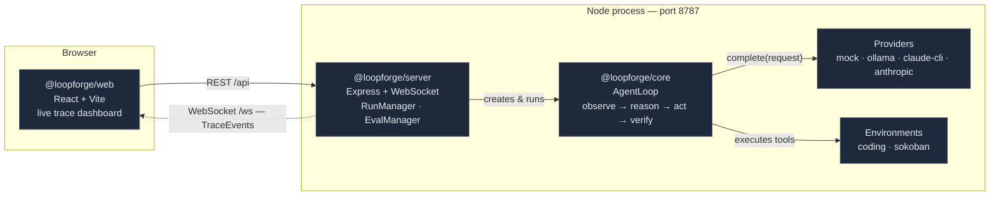

# LoopForge

**An agent-loop engineering, observability, and evaluation platform.** LoopForge takes the loop at the heart of every modern AI agent — *observe → reason → act → verify* — and makes it a first-class, observable object instead of a black box: every model turn, thinking block, tool call, and result streams live to a trace dashboard as a structured event. The same loop runs interchangeably against four model providers (a scripted mock, a local Ollama model, the logged-in Claude Code CLI, or the Claude API) and two pluggable environments (a sandboxed coding project and a Sokoban game arena), and a deterministic eval harness runs whole task suites as scored runs and ranks providers on a live leaderboard.

> The agent loop is the heart of every modern AI agent. Most frameworks hide it behind a final answer. LoopForge inverts that: the loop emits a typed `TraceEvent` for every meaningful moment, and everything else — the server, the dashboard, the scorer — is just a consumer of that one event stream.

## What it is

- **A provider-agnostic agent loop** (`@loopforge/core`) — `AgentLoop` runs observe → reason → act → verify, owns the conversation and tool execution, and emits a `TraceEvent` for every step (iteration start, model request/response with thinking, tool started/finished, env state, run finished).
- **A run + eval orchestrator** (`@loopforge/server`) — an Express + WebSocket server (port **8787**) that creates runs, records each event log, broadcasts every event live, and drives batch evals.
- **A live trace dashboard** (`@loopforge/web`) — a React + Vite app that folds the event stream into per-iteration cards, an animated Sokoban board, and an eval leaderboard.
- **A deterministic evaluation harness** — task suites run as real scored runs, judged pass/fail purely from their recorded events, aggregated into pass-rate and cost metrics.
- **A portfolio-grade codebase** — TypeScript throughout, npm workspaces, 28 `node:test` tests, and an adversarial audit-hardening pass that fixed 11 confirmed bugs, each locked down with a regression test.

## Feature highlights

- **Four interchangeable providers, one loop.** Swap the model backing the exact same loop with no code changes:
  - **Run a real frontier model with *no API key*** — `claude-cli` drives your locally-installed, logged-in Claude Code CLI as a single-turn model (its own tools disabled, our loop runs the tools).
  - **Run a real model for *free*** — `ollama` drives a local model (e.g. `llama3`) through a ReAct JSON adapter — no key, no per-token cost.
  - **Zero-setup demo** — `mock` replays deterministic scripts whose tool calls *execute for real*, so the demo genuinely runs without any key.
  - **Live API** — `anthropic` calls the Claude API directly with adaptive extended thinking.
- **Two pluggable environments.** A whole new domain plugs in behind one `RunEnvironment` interface without touching the loop: a sandboxed **coding** project (four path-confined tools + a planted bug to fix) and a **sokoban** game arena (an in-memory engine with a live, animated board).
- **Deterministic eval harness with a live leaderboard.** Run a suite × N repeats as concurrency-capped real runs; a deterministic, event-based scorer marks each pass/fail (with an anti-cheat so echoing a test file can't false-pass); pass rate, mean iterations, tokens, and duration aggregate live, and a cross-provider leaderboard ranks backends head-to-head.
- **Live trace dashboard.** Every run streams over WebSocket — thinking, tool inputs/outputs, token usage, and status — and any eval result row drills into the identical trace + board UI, because an eval run *is* a real run under the hood.

## Architecture

Three npm-workspace packages, layered so dependencies only ever point inward toward the pure core.



```
loopforge/
├── packages/core      Agent-loop engine: loop, providers, tools, trace events
├── packages/server    Run + eval orchestration: REST + WebSocket streaming
├── packages/web       Live trace dashboard (React + Vite)
├── sandbox/           Seeded coding project the agent operates on
└── docs/              Full documentation set (see below)
```

For the deep dive — the loop lifecycle, the `TraceEvent` model, and the extensibility seams — see **[docs/ARCHITECTURE.md](docs/ARCHITECTURE.md)**.

## Providers

The same agent loop runs against all four providers; the two local ones (Ollama, Claude CLI) share the `packages/core/src/providers/react.ts` adapter.

| Provider | What it is | API key? | Cost | Native tool-calling? |
|---|---|---|---|---|
| **`mock`** | Scripted, deterministic steps — but its tool calls execute for real | No | None | n/a (script emits calls) |
| **`ollama`** | A local model via Ollama (`llama3:latest` default) | No | None (local compute) | No — uses the ReAct adapter |
| **`claude-cli`** | The logged-in Claude Code CLI (`claude -p`) driven as a single-turn model | No — uses the CLI's account | Real per-iteration account usage | No — CLI tools disabled on purpose |
| **`anthropic`** | The Claude API via `@anthropic-ai/sdk` (`claude-opus-4-8` default) | **Yes** — `ANTHROPIC_API_KEY` | Paid API tokens | **Yes** — the only native-tools provider |

Every provider works in both the **Runs** view and the **Eval** harness. Running the demo suite under a real local model produces an honest capability profile — e.g. `llama3` typically solves the coding bug-fix but not Sokoban, landing the eval near 50%, right next to `mock`'s designed 100%. Full contract, per-provider internals, and the ReAct adapter: **[docs/PROVIDERS.md](docs/PROVIDERS.md)**.

## Quickstart

No API key needed for the default **mock** provider.

```bash
npm install

# Terminal 1 — REST API + WebSocket trace stream (http://localhost:8787)
npm run dev:server

# Terminal 2 — React dashboard (http://localhost:5173)
npm run dev:web
```

Open **http://localhost:5173** and start a **mock** run — no setup required. The scripted agent finds and fixes a real bug in a seeded calculator project: its tool calls actually execute — it lists files, reads the failing test, runs `node test.js` red, patches `calc.js` (which ships with `add` returning `a - b`), and re-runs the test green. Then try a **sokoban** run to watch the agent push boxes on a live board, or open the **Eval** tab and run the `demo` suite (deliberately 2 pass / 2 fail under `mock`) to see the scorer and leaderboard in action.

Vite proxies `/api` and `/ws` to `:8787`, so the dashboard talks to the server transparently. To try a real model with no API key, install [Ollama](https://ollama.com) (`ollama pull llama3`) and pick **Local (Ollama · llama3)**, or use the logged-in **Claude CLI (local account)** provider. Full setup — including each provider's prerequisites and the `.env` for the live API — is in **[docs/DEVELOPMENT.md](docs/DEVELOPMENT.md)**.

## Documentation

Start with the **[documentation index](docs/README.md)**, or jump straight in:

- **[Architecture](docs/ARCHITECTURE.md)** — the observable loop, monorepo layering, the `TraceEvent` model, and the extensibility seams.
- **[Providers](docs/PROVIDERS.md)** — the four model backends and the shared ReAct adapter.
- **[Environments](docs/ENVIRONMENTS.md)** — the `RunEnvironment` seam, the coding sandbox, and the Sokoban arena.
- **[Eval Harness](docs/EVAL_HARNESS.md)** — scored suites, the deterministic scorer, and the live leaderboard.
- **[Development](docs/DEVELOPMENT.md)** — build, run, and test locally; per-provider setup; the roadmap.

## Roadmap

| Phase | Scope | Status |
|---|---|---|
| 1 | Core agent loop engine + live trace dashboard + coding tools + mock mode | ✅ Done |
| 2 | Sokoban game-arena environment via pluggable environments | ✅ Done |
| 3 | Eval harness — task suites, parallel scored runs, pass-rate aggregation, leaderboard, per-run sandbox isolation | ✅ Done |
| — | Local providers: **Ollama** (no-key local model) + **Claude CLI** (local account) | ✅ Done |
| — | Audit hardening + `node:test` suites (11 bugs fixed, 28 tests) | ✅ Done |
| 4 | Richer coding environment — multi-file tasks + diff view | ⏳ Next |
| 5 | Autonomous QA agent environment (Playwright-driven) | ⏳ Next |
| — | Model-selection-per-provider so the leaderboard compares specific models head-to-head | ⏳ Next |

## Testing

```bash
npm run typecheck               # tsc --noEmit across all workspaces
npm test -w @loopforge/core     # 17 tests
npm test -w @loopforge/server   # 11 tests
```

28 deterministic `node:test` tests (run through `tsx`, no network, no model): the ReAct JSON adapter, the sandboxed coding tools, the Sokoban engine, and the deterministic scorer — each regression test naming the bug it locks down.

## Security note

`run_command` executes real shell commands, confined to the per-run sandbox directory (`os.tmpdir()/loopforge-run-<runId>`) with a **30-second timeout**, and the file tools are path-confined to that sandbox via `realpath` (so a symlink inside the sandbox can't escape it). This is a **local development / portfolio tool**: there is no syscall or network isolation, a command still has shell access *within* the sandbox dir, and runs only ever start when you start them. Run LoopForge on your own machine, not as a service exposed to untrusted input. Details in **[docs/ENVIRONMENTS.md](docs/ENVIRONMENTS.md)**.
