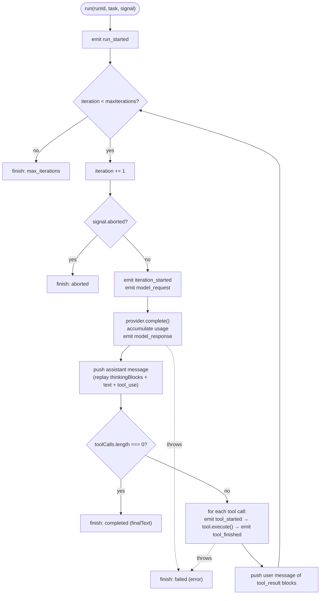
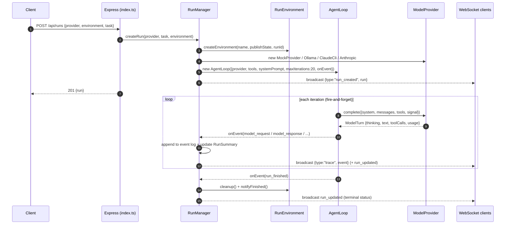
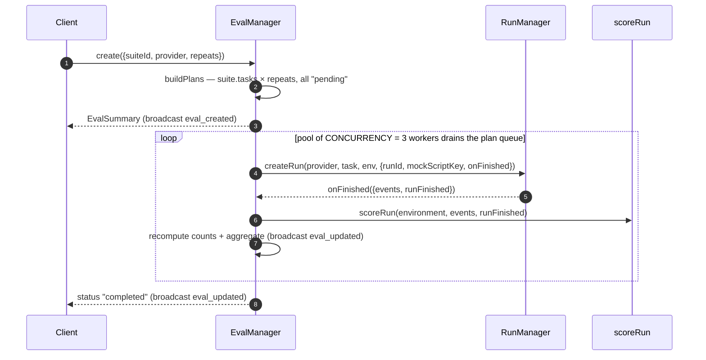

# LoopForge Architecture

> The system-design overview: how LoopForge turns an LLM agent loop into a first-class, observable object and streams every step of it to a live dashboard and an eval harness.

**Why this exists.** Most agent frameworks treat the loop as a black box — you get a final answer, maybe a log dump. LoopForge inverts that: the loop emits a structured `TraceEvent` for every meaningful moment, and everything else (the server, the dashboard, the scorer) is a consumer of that one event stream. This doc explains the layering, the loop lifecycle, the event model that ties it together, and the seams that make it extensible.

---

## The core idea: the loop is the observable object

The unit of the system is one `AgentLoop.run(...)`. It runs the classic cycle — **observe → reason → act → verify** — and instead of hiding that cycle behind a return value, it publishes it as a sequence of typed events through a single `onEvent` callback (`packages/core/src/loop.ts`).

```ts
// packages/core/src/loop.ts
export interface AgentLoopOptions {
  provider: ModelProvider;
  tools: Tool[];
  systemPrompt: string;
  /** Safety valve against runaway loops. Default 20. */
  maxIterations?: number;
  onEvent: (event: TraceEvent) => void;
}
```

The loop owns the conversation state and tool execution; it depends only on three abstractions — `ModelProvider`, `Tool`, and the `TraceEvent` type — and knows nothing about HTTP, WebSockets, React, or which model is behind the provider. That single `onEvent` seam is what lets the same loop drive a live dashboard, a recorded event log, and a deterministic scorer without any of them coupling to each other.

---

## Monorepo layout and dependency direction

Three npm-workspace packages, layered so dependencies only ever point **inward** toward the pure core.

```mermaid
flowchart LR
  web["@loopforge/web<br/>React 18 + Vite<br/>live trace dashboard"]
  server["@loopforge/server<br/>Express + WebSocket<br/>run &amp; eval orchestration"]
  core["@loopforge/core<br/>AgentLoop, providers,<br/>tools, TraceEvent"]

  server -->|package dep: &quot;@loopforge/core&quot;| core
  web -.->|type-only import of events.ts<br/>(erased at build)| core

  classDef pkg fill:#1e293b,stroke:#475569,color:#e2e8f0;
  class web,server,core pkg;
```

- **`@loopforge/core`** — the provider-agnostic loop and its parts. Its only runtime dependency is `@anthropic-ai/sdk` (for `AnthropicProvider`); it has **no dependency on server or web**. It is the leaf of the graph.
- **`@loopforge/server`** — depends on core via `"@loopforge/core": "*"`. It imports the loop, providers, and types, then wires them to environments, a REST API, and a WebSocket broadcast.
- **`@loopforge/web`** — depends only on `react` / `react-dom`. Notably it does **not** list `@loopforge/core` as a package dependency at all; it reaches core's event definitions with a **type-only** relative import and re-exports them:

```ts
// packages/web/src/types.ts
import type { TraceEvent, TokenUsage, RunStatus } from "../../core/src/events";
export type { TraceEvent, TokenUsage, RunStatus, ToolCallRef } from "../../core/src/events";
```

Because these are `import type` (erased at build time), no Node-only core code ever reaches the browser bundle — the dashboard shares the *shape* of trace events with the loop that produces them, but not a byte of runtime code. `RunSummary` and the WebSocket message unions on the web side are hand-mirrored copies of the server's API contract, kept deliberately structural.

The direction never reverses: **core imports nothing from server or web; web imports only core types; server sits in the middle.**

---

## The agent loop lifecycle (one `run`)

`AgentLoop.run(runId, task, signal?)` seeds a single user message from the task, then iterates until the model stops calling tools or a limit trips. Each iteration maps onto observe → reason → act → verify:

- **observe** — assemble the running `messages[]` and emit `iteration_started` + `model_request`.
- **reason** — call `provider.complete(...)`, accumulate token usage, emit `model_response` (thinking, text, tool calls).
- **act** — if the turn made tool calls, execute each one against the environment's tools, emitting `tool_started` / `tool_finished` per call.
- **verify** — the next iteration re-observes the `tool_result` blocks and decides whether to keep going. A turn with **zero** tool calls is the model declaring itself done → the run completes.



Details that matter for accuracy:

- **Four terminal statuses**, each produced by the shared `finish(...)` helper which emits `run_finished`: `completed` (no tool calls), `max_iterations` (loop guard, default **20**), `aborted` (the `signal` is checked before each iteration *and* before each tool call), and `failed` (anything thrown escapes to the top-level `catch`).
- **Thinking-block replay.** When a provider returns `thinkingBlocks` (raw blocks with signatures), the loop pushes them back verbatim into the assistant message. This is required for faithful continuation against the Claude API when extended thinking is on — dropping them makes the API reject the next request.
- **Tool-result pairing.** Every `tool_use` in the assistant turn is answered by exactly one `tool_result` (matched by id) in the following user message. Unknown tools, thrown tools, and empty output are all normalized to a non-empty result string (`"(no output)"`) so the next request stays well-formed.

---

## The `TraceEvent` model — the backbone

Everything downstream is a projection of one discriminated union (`packages/core/src/events.ts`). It is pure types with zero runtime dependencies, which is exactly why the browser can import it. Eight variants:

| Event | Fires when | Key fields |
|---|---|---|
| `run_started` | Once, at the very top of `run()` | `task`, `provider`, `model` |
| `iteration_started` | Top of each loop iteration | `iteration` |
| `model_request` | Just before `provider.complete()` | `iteration`, `messageCount` |
| `model_response` | Right after the provider returns a turn | `thinking?`, `text?`, `toolCalls`, `usage` |
| `tool_started` | Before each tool executes | `toolCallId`, `name`, `input` |
| `tool_finished` | After each tool executes | `toolCallId`, `name`, `output`, `isError`, `durationMs` |
| `env_state` | An environment publishes a state snapshot (**emitted by the harness, not the loop**) | `seq`, `state` |
| `run_finished` | Once, at any terminal status | `status`, `finalText?`, `error?`, `iterations`, `totalUsage`, `durationMs` |

Two subtleties:

- **`env_state` is special.** The `AgentLoop` never emits it. Environments (e.g. a Sokoban board) push state through a `publishState` callback the server wires up, so the snapshot flows through the *same* event pipeline as loop events. Its monotonic `seq` gives each snapshot a stable identity so a client never conflates two emitted in the same millisecond.
- **`RunStatus`** is `"running" | "completed" | "failed" | "aborted" | "max_iterations"`; `run_finished.status` is `Exclude<RunStatus, "running">`, i.e. only the four terminal values.

```ts
// packages/core/src/events.ts
export type RunStatus =
  | "running" | "completed" | "failed" | "aborted" | "max_iterations";
```

Because a run is *fully* described by its ordered `TraceEvent[]`, the log is both the live feed and the historical record — and, as we'll see, the sole input to scoring.

---

## End-to-end data flow of a RUN

A manual run is a `POST /api/runs`. The HTTP handler validates and returns immediately (`201`); the loop runs fire-and-forget, streaming events out over the WebSocket as they happen.



What `RunManager` (`packages/server/src/run-manager.ts`) does at each hop:

1. **`createRun(provider, task, environment = "coding", options)`** allocates the `runId` (or uses `options.runId`, which an eval pre-assigns), builds a `publishState` closure (bumps `envSeq`, routes an `env_state` event through the normal path), and calls `createEnvironment(...)`.
2. It picks the provider: `mock` replays a script (`buildMockScript(options.mockScriptKey)` for evals, else `env.buildDemoScript?.()`) and forces `effectiveTask = env.demoTask`; the real providers (`ollama`, `claude-cli`, `anthropic`) use the model, falling back to `env.demoTask` if no task was given.
3. It creates the `AbortController`, the `RunSummary` (status `"running"`), and the `AgentLoop`, wiring `onEvent` to `handleEvent`, then broadcasts `run_created` and starts the loop fire-and-forget.
4. **`handleEvent(record, event)`** appends every event to the run's log, folds a few into the live `RunSummary` (`iteration_started` → `iterations`; `model_response` → accumulate `usage`; `run_finished` → status/iterations/usage), then broadcasts `{type:"trace", event}` and a `run_updated` when the summary changed. On `run_started` it lets the environment publish its opening state; on `run_finished` it runs `cleanup()` (best-effort teardown, e.g. deleting the per-run sandbox) and `notifyFinished()`.
5. **Exactly-once finish.** A `notified` guard ensures `onFinished` fires once, whether the run ended via `run_finished` or a throw outside that flow (the fire-and-forget `.catch` synthesizes a `failed` terminal notice).

The wire contract to the dashboard is the `ServerMessage` union — `run_created`, `trace`, `run_updated` — plus the eval messages, all pushed by `broadcast(...)` in `index.ts` to every open socket on `/ws` (port **8787**). The dashboard's reducer dedupes by event key and folds the stream into per-iteration cards.

---

## How the same pipeline powers an EVAL

An eval is not a separate execution engine — it is a batch of **real runs** driven through the exact same `RunManager.createRun`, each scored from its recorded events (`packages/server/src/eval-manager.ts`). That reuse is the point: a result row can drill into the identical trace/board UI a manual run uses, because it *is* a manual run under the hood.



- **Planning.** `buildPlans` expands `suite.tasks × repeats` into `EvalRunResult` slots (each with a pre-assigned `runId`), all starting `pending`. The `EvalSummary` returns immediately with everything pending; execution proceeds async.
- **Execution.** A fixed pool of `CONCURRENCY = 3` workers drains the plan queue. Each `runOne` starts a real run via `createRun(...)`, passing the pre-assigned `runId`, the task's `mockScriptKey` (**only** when the provider is `mock`), and an `onFinished` callback.
- **Scoring.** When the run finishes, `onFinished` hands back `{events, runFinished}`; the eval calls `scoreRun(environment, events, runFinished)` and records `runStatus`, `iterations`, `usage`, `durationMs`, and the `RunScore`.
- **Aggregation.** `recompute` recounts scored/passed/failed and rebuilds the `EvalAggregate` (`passRate`, `meanIterations`, `meanTokensIn/Out`, `meanDurationMs`) over the scored runs, broadcasting `eval_updated` after each. When the pool drains, the eval flips to `"completed"`.

Scoring is deterministic and **event-based** (`packages/server/src/eval/scorer.ts`) — no sandbox inspection, no model in the loop:

- Any run that ended `failed` or `aborted` is an automatic fail.
- **coding** passes only if some `run_command` that *actually executes the tests* (correlated by matching the `tool_started` command string to the `tool_finished` output) finished without error and printed `"All tests passed"` — so a `cat test.js` can't masquerade as a green test run.
- **sokoban** passes iff some published `env_state` reports `solved === true`.

The demo suite is deliberately a 2-pass / 2-fail set under the mock provider, which proves the scorer distinguishes a genuine fix from a lazy one.

---

## The abstraction seams that make it extensible

Three interfaces are where you plug in new behavior without touching the loop:

1. **`ModelProvider`** (`packages/core/src/provider.ts`) — the "what drives the loop" seam. One method, `complete(request): Promise<ModelTurn>`, plus `name` / `model`. The loop owns conversation state and tool execution; a provider only translates a `ModelRequest {system, messages, tools, signal}` into a `ModelTurn {thinking?, thinkingBlocks?, text?, toolCalls, usage}`. Implementations: `MockProvider`, `OllamaProvider`, `ClaudeCliProvider`, `AnthropicProvider` — all interchangeable, all exported from `@loopforge/core`.

```ts
// packages/core/src/provider.ts
export interface ModelProvider {
  readonly name: string;
  readonly model: string;
  complete(request: ModelRequest): Promise<ModelTurn>;
}
```

2. **`RunEnvironment`** (`packages/server/src/environments/index.ts`) — the "what the agent operates on" seam. It supplies the `tools` the model may call, the `systemPrompt`, a `demoTask`, and optional lifecycle hooks (`buildDemoScript?`, `prepare?`, `onRunStart?`, `cleanup?`). The `createEnvironment(name, publishState, runId)` factory builds a **fresh instance per run** so stateful environments never leak between runs. Implementations: `coding` (per-run temp sandbox) and `sokoban` (in-memory game + live board).

3. **The scorer** (`scoreRun`) — the "what counts as success" seam. Keyed by `EnvironmentName`, it reads only the finished run's `TraceEvent[]`, so a new environment adds a branch here and needs nothing from the loop or the providers.

These seams compose freely: any of the four providers runs against either environment, in both the Runs view and the Eval harness, because none of them knows about the others — they only meet through `TraceEvent` and the three interfaces above.

---

## Extending LoopForge

- **Add a model provider** — implement `ModelProvider`, export it from `@loopforge/core`, register its name in `RunManager`. See **[Providers](PROVIDERS.md)** for the provider contract, the shared ReAct adapter, and the thinking-block replay rules.
- **Add an environment** — implement `RunEnvironment`, wire it into `createEnvironment`, and add a scorer branch. See **[Environments](ENVIRONMENTS.md)** for the environment lifecycle, tool authoring, and `env_state` publishing.
- **Add a scored task suite** — the eval harness runs any provider × environment as a batch of scored runs. See **[Eval Harness](EVAL_HARNESS.md)** for suites, the deterministic scorer, and the live leaderboard.

---

## Related documentation

- **[Providers](PROVIDERS.md)** — the four model backends behind the `ModelProvider` seam and the shared ReAct adapter.
- **[Environments](ENVIRONMENTS.md)** — the `RunEnvironment` seam: coding sandbox and Sokoban arena.
- **[Eval Harness](EVAL_HARNESS.md)** — batch scored runs, the deterministic event-based scorer, and the leaderboard.
- **[Development](DEVELOPMENT.md)** — build, run, and test LoopForge locally.
- **[Documentation index](README.md)** — all docs in reading order.
