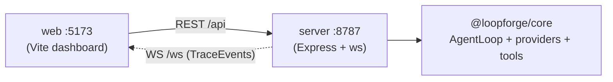

# Development Guide

> One doc for building, running, and testing LoopForge locally — plus the quality bar the codebase is held to and where it's going next.

**Why this exists.** LoopForge is a small monorepo with a few moving parts (a core loop engine, an Express + WebSocket server, a Vite dashboard) and four interchangeable model providers, each with different local prerequisites. This guide is the single place a developer — or a reviewer reading the repo — can go to get it running, understand what the test suite actually verifies, and see the roadmap. Ground truth throughout is the code; every command, path, and behavior below is pulled from source.

---

## 1. Prerequisites and setup

LoopForge is a TypeScript project using **npm workspaces** (`packages/*`). There is no build step for local dev — the server and tests run TypeScript directly through [`tsx`](https://www.npmjs.com/package/tsx), and the web app runs through Vite.

- **Node.js** — Node 22 LTS is recommended (it matches `@types/node@^22`). Node 20+ works for the server and web, but the test scripts pass a glob to `node --test` (`"src/**/*.test.ts"`), which needs a Node whose test runner expands globs — use Node 22 to be safe.
- **npm** — v10+ (ships with Node 22), for workspace support.
- **Playwright Chromium** *(optional — browser environment only)* — the **browser** (Web QA) environment drives a headless Chromium through Playwright. The npm package installs with the workspace, but the browser binary is a separate one-time download (~95 MB):

  ```bash
  npx playwright install chromium
  ```

  This is genuinely optional: Playwright is imported lazily (`packages/server/src/environments/browser.ts`), so the server boots and the coding/sokoban environments work without it — browser tool calls just return errors that include this exact install hint.

Install once from the repo root; workspaces are hoisted:

```bash
git clone <repo> loopforge
cd loopforge
npm install
```

That installs dependencies for all three packages (`@loopforge/core`, `@loopforge/server`, `@loopforge/web`). No environment file is required to run the default **mock** provider.

---

## 2. Running locally

Two long-running processes, one per terminal. The server is the API + WebSocket hub; the web app is the live dashboard.

```bash
# Terminal 1 — REST API + WebSocket trace stream (http://localhost:8787)
npm run dev:server        # -> tsx watch packages/server/src/index.ts

# Terminal 2 — React dashboard (http://localhost:5173)
npm run dev:web           # -> vite
```

Open http://localhost:5173. Vite proxies `/api` and `/ws` to the server (see `packages/web/vite.config.ts`), so the dashboard talks to `:8787` transparently. Start a **mock** run to see the loop stream live — no API key, its tool calls execute for real against a per-run temp copy of the seeded demo project (see [ENVIRONMENTS.md](ENVIRONMENTS.md) — runs never touch `sandbox/demo-project` itself). The server also boots the seeded **LoopMart** demo shop (the browser environment's QA target, and the only origin its tools may visit) on **http://localhost:8788** (`packages/server/src/target-site.ts`).



### The four providers and what each needs

All four drive the **same** `AgentLoop`; they differ only in what backs the model turn. Provider names are the union `"mock" | "anthropic" | "ollama" | "claude-cli"` (`packages/server/src/run-manager.ts`).

| Provider | Backing model | Local prerequisite | API key / cost |
|---|---|---|---|
| **mock** | Scripted `MockProvider` (`packages/core/src/providers/mock.ts`) | **Nothing.** Deterministic scripts, but tool calls execute for real. | None |
| **ollama** | Local model via `OllamaProvider` | A running [Ollama](https://ollama.com) daemon with a pulled model. Defaults to `qwen3:14b` at `http://localhost:11434`. | None |
| **claude-cli** | The locally-installed `claude` Code CLI, driven as a model | The `claude` CLI on `PATH` and **logged in** to an account. | Uses the CLI's account quota (no separate key) |
| **anthropic** | Claude API via `AnthropicProvider` | — | `.env` with `ANTHROPIC_API_KEY` |

Details worth knowing:

- **ollama** — install Ollama, then `ollama pull qwen3:14b`, then pick the local provider in the dashboard. `OllamaProvider` deliberately routes through the shared **ReAct JSON adapter** (`packages/core/src/providers/react.ts`) rather than native tool-calling: the model emits a JSON action and *our* loop runs the tool.
- **claude-cli** — `ClaudeCliProvider` (`packages/core/src/providers/claude-cli.ts`) spawns `claude -p` per turn with the CLI's own tools disabled (a no-op `--allowedTools` allowlist) and a planner-framed ReAct system prompt, so the CLI returns *our* JSON action and LoopForge's loop executes it against the sandbox/game tools. Each iteration is one `claude -p` call — real account quota, meant for showcasing a frontier model locally, not high-volume runs.
- **anthropic** — copy the template and paste a key; the server auto-loads it at startup (`packages/server/src/load-env.ts`).

  ```bash
  cp .env.example .env       # .env is gitignored
  # edit .env: ANTHROPIC_API_KEY=sk-ant-...
  ```

Every provider works in both the **Runs** view and the **Eval** harness.

---

## 3. Project scripts

Scripts live at two levels: workspace-wide (root `package.json`) and per-package.

**Root:**

| Command | Effect |
|---|---|
| `npm run dev:server` | Start the server in watch mode (delegates to `-w @loopforge/server`). |
| `npm run dev:web` | Start the Vite dev server (delegates to `-w @loopforge/web`). |
| `npm run typecheck` | `tsc --noEmit` across **all** workspaces. |

**Per-package** (run with `-w <pkg>`, e.g. `npm run typecheck -w @loopforge/core`):

| Package | `typecheck` | `test` | `build` / `dev` |
|---|---|---|---|
| `@loopforge/core` | `tsc --noEmit` | `node --import tsx --test "src/**/*.test.ts"` | — |
| `@loopforge/server` | `tsc --noEmit` | `node --import tsx --test "src/**/*.test.ts"` | `dev` = `tsx watch src/index.ts`, `start` = `tsx src/index.ts` |
| `@loopforge/web` | `tsc --noEmit` | — | `dev` = `vite`, `build` = `vite build` |

Common flows:

```bash
npm run typecheck                       # typecheck the whole monorepo
npm run build -w @loopforge/web         # production build of the dashboard
npm test -w @loopforge/core             # core unit tests
npm test -w @loopforge/server           # server unit tests
```

There is no aggregate `npm test` at the root — the two `test` scripts live on `@loopforge/core` and `@loopforge/server` (the web package has no unit tests, only `typecheck`).

---

## 4. Testing

The suites are plain `node:test` files run through `tsx`, colocated next to the code they cover (`*.test.ts`). **53 tests total, all green** (17 in core, 36 in server).

```bash
npm test -w @loopforge/core     # 17 tests
npm test -w @loopforge/server   # 36 tests
```

### What each suite covers

**`packages/core/src/providers/react.test.ts`** — the ReAct JSON adapter shared by the Ollama and Claude-CLI providers (11 tests). Parsing bare JSON, `` ```json ``-fenced JSON, leading prose captured as the "thought", `reactActionToTurn` mapping tool/final/prose actions, `buildReactSystemPrompt` (incl. planner mode), and `renderReactTranscript`. The load-bearing regression:

```ts
test("REGRESSION: code fences INSIDE a JSON string value are preserved", () => {
  // The bug: stripping ``` over the whole output corrupted write_file content.
  const content = "# Title\n```js\nconst x = 1;\n```\n";
  const raw = JSON.stringify({ tool: "write_file", input: { path: "R.md", content } });
  const a = parseReactAction(raw);
  assert.equal(a?.input.content, content, "content must round-trip byte-for-byte");
});
```

**`packages/core/src/coding-tools.test.ts`** — the sandboxed coding tools from `createCodingTools` (6 tests). `write_file`/`read_file` round-trip, code fences written verbatim, `list_files`, `run_command` stdout + exit code, lexical `..` rejection, and the symlink-escape regression that proves confinement is `realpath`-based, not just string prefix:

```ts
test("REGRESSION: a symlink pointing outside the sandbox is rejected", async () => {
  await fs.symlink("/etc", path.join(root, "link"));
  const r = await tools.read_file.execute({ path: "link/hosts" });
  assert.equal(r.isError, true, "reading through an escaping symlink must fail");
});
```

**`packages/server/src/environments/sokoban.test.ts`** — the `SokobanGame` engine (5 tests). Fresh-game invariants, wall-blocked moves leave state unchanged, pushing a box onto a goal solves a level, a box can't be pushed into another box, and the regression that the *scripted demo solution actually solves the level* (it replays every `move` from `buildSokobanDemoScript()` and asserts `solved === true`).

**`packages/server/src/environments/coding.test.ts`** — the coding environment's `coding_files` diff snapshots plus the provider model override (6 tests). `write_file` publishes cumulative snapshots with `before` frozen at the first write, failed writes and non-write tools publish nothing, before/after beyond 50,000 chars are truncated — and three tests pin that `OllamaProvider` / `ClaudeCliProvider` / `AnthropicProvider` each take the model override as their first constructor argument (so `CreateRunOptions.model` can never silently stop reaching them).

**`packages/server/src/environments/browser.test.ts`** — the browser environment without a real browser (5 tests). The four QA tools and demo task are exposed; `goto` rejects non-sandbox origins and malformed URLs *without launching Chromium*; `click`/`fill` validate their inputs the same way; and the paired demo scripts diverge exactly as designed (q1's script ends by clicking *Place order*, q2's never does).

**`packages/server/src/target-site.test.ts`** — the seeded LoopMart shop (5 tests, against a real `http.Server` on an ephemeral port). Home, products (3 items with *Add to cart* links), and the checkout form serve correctly; unknown paths 404; and the planted bug is pinned exactly — `POST /order` is always a 500 carrying the `Internal Server Error (500)` / `ERR_ORDER_FAILED` markers the scorer keys on.

**`packages/server/src/eval/suites.test.ts`** — the suite definitions (4 tests). The `web-qa` suite has exactly 2 browser tasks with the demo task text, both suites are listed, the scripts behind q1/q2 actually differ on the *Place order* click, and a regression pins the demo suite at exactly 4 tasks.

**`packages/server/src/eval/scorer.test.ts`** — the deterministic, event-based `scoreRun` (11 tests). Coding PASS requires a `run_command` that *executes* the tests and prints `All tests passed`; sokoban PASS requires a solved `env_state`; browser PASS requires a **successful `click`** whose output contains the planted 500 (an errored click or a non-click tool surfacing the text does not pass); a `failed` run is always a fail. The headline regression protects against a lazy false-pass:

```ts
test("REGRESSION: `cat test.js` echoing the source string does NOT pass", () => {
  // The phrase lives in test.js's source; a mere read must not count as a run.
  const catOutput = 'console.log("All tests passed");\n[exit code: 0]';
  // ... run_command "cat test.js" ...
  assert.equal(scoreRun("coding", events, finished("completed")).passed, false);
});
```

`scoreRun` correlates each `tool_finished` back to the command that produced it (`isTestExecution` in `scorer.ts` matches `node … test` / `npm test` / `npx … test`), so echoing the source string can't masquerade as a passing run.

### Testing philosophy

The suite is **deterministic pure-logic tests plus a documented runtime smoke**. Each test targets a piece of extractable logic — a parser, a path-confinement check, a game engine, a scorer — with no network, no model, and no wall-clock dependence, so the suite is fast and stable. Behaviors that only emerge from real processes (a live model, WebSocket streaming, the Vite proxy) aren't faked into unit tests; they're captured as a **runtime smoke** run against the actual providers and recorded alongside the change: *mock eval 2/2, sokoban `seq` monotonic, ollama coding pass* (from the audit-hardening commit). Every regression test also names the bug it locks down, so the suite doubles as a changelog of failure modes.

---

## 5. Quality bar

This is a portfolio repo, so correctness is treated as a feature. After the feature phases landed, the codebase went through an **adversarial multi-agent audit** — parallel automated code review plus runtime verification against every provider — which found and fixed **11 confirmed bugs** in one hardening pass (`git show 5f31a77`), each backed by a regression test where the logic was extractable. The classes of bug caught, as evidence the loop was pressure-tested rather than merely demoed:

- **JSON / encoding corruption** — the ReAct adapter stripped code fences over the *whole* model output, corrupting `write_file` content that legitimately contained fences; fixed to parse the tool-call JSON from the raw string. Separately, `claude-cli` now sets `utf8` encoding so a multibyte character split across stdout chunks isn't mangled.
- **False-pass scoring** — coding runs could "pass" by `cat`-ing `test.js` (whose source contains the success string). Scoring now requires a `run_command` that *actually executes* the tests.
- **Empty `tool_result`** — an empty tool output produced an empty content block that the Claude API rejects; the loop now coerces empty output to a non-empty `tool_result`.
- **Symlink escape** — sandbox confinement was lexical, so a symlink inside the sandbox pointing at `/etc` could read outside it; confinement is now `realpath`-based.
- **Abort propagation** — the `AbortSignal` wasn't threaded into `provider.complete` / `tool.execute`, and `claude-cli` didn't kill its child on abort; both fixed so a cancelled run actually stops work.
- **Error-contract** — malformed request bodies bypassed the `{ error }` JSON response shape; a JSON error middleware now preserves the contract, and a per-socket `try/catch` isolates one bad WebSocket from the broadcast. A synchronous run-start failure in the eval pool now finalizes its slot instead of hanging the whole eval.
- **Reconnect staleness** — `env_state` snapshots colliding within the same millisecond deduped incorrectly, so the fix added a monotonic `seq` the web layer dedupes on; and the dashboard now re-fetches the selected eval's full detail on WebSocket reconnect instead of showing a stale table.

The takeaway for a reviewer: the interesting bugs here are the *quiet* ones — a scorer that trusts the wrong signal, a sandbox that trusts a path string, a stream that loses a byte at a chunk boundary — and they were hunted deliberately, fixed, and locked down with tests.

---

## 6. Roadmap

| Phase | Scope | Status |
|---|---|---|
| 1 | Core agent loop engine + live trace dashboard + coding tools + mock mode | ✅ Done |
| 2 | Sokoban game-arena environment via pluggable environments | ✅ Done |
| 3 | Eval harness — task suites, parallel scored runs, pass-rate aggregation, leaderboard, per-run sandbox isolation | ✅ Done |
| — | Local providers: **Ollama** (no-key local model) + **Claude CLI** (local account) | ✅ Done |
| — | Audit hardening + `node:test` suites (11 bugs fixed, 28 tests) | ✅ Done |
| 4 | Per-provider **model selection** (leaderboard keyed by provider + model) + coding **file-diff view** | ✅ Done |
| 5 | Autonomous web-QA agent environment (Playwright) vs the seeded LoopMart shop | ✅ Done |
| — | Multi-file coding tasks | ⏳ Next |
| — | More eval suites | ⏳ Next |
| — | CI | ⏳ Next |

The phase history is legible in git: `cbf9213` (Phase 1), `ef973e6` (Phase 2), `067812a` (Phase 3), `976af7c` (Ollama), `7a180b5` (Claude CLI), `5f31a77` (audit hardening + tests), `2d2143c` (Phase 4), `fdaffdb` (Phase 5).

---

## Related documentation

- **[Architecture](ARCHITECTURE.md)** — the system design: loop lifecycle, the `TraceEvent` model, and package layering.
- **[Providers](PROVIDERS.md)** — the four model backends and the shared ReAct adapter.
- **[Environments](ENVIRONMENTS.md)** — the coding sandbox and Sokoban arena the agent operates on.
- **[Eval Harness](EVAL_HARNESS.md)** — task suites, the deterministic scorer, and the leaderboard.
- **[Documentation index](README.md)** — all docs in reading order.
