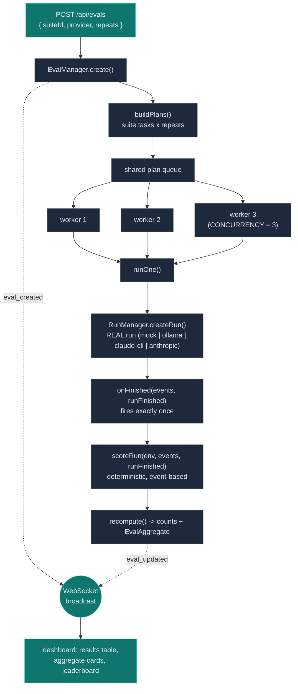

# LoopForge Eval Harness

> The evaluation layer: run a whole task suite as REAL agent runs, score each one pass/fail with a deterministic event-based scorer, and aggregate into a live leaderboard.

**Why this exists.** A trace dashboard tells you *what an agent did*; an eval harness tells you *whether it worked* — repeatably, across a suite, without a human (or a second model) grading the transcript. The point of the LoopForge eval layer is to prove the harness can tell success from failure on its own: every run is judged purely from its recorded `TraceEvent[]` by a deterministic scorer, so a run either produced the events that constitute success or it did not. That is what makes an aggregate `passRate` mean something. This doc covers what an eval is, the two shipped suites (`demo` and `web-qa`), the scorer, the `EvalManager` pipeline, the WebSocket messages, and how to run a real-model eval for free.

---

## What an eval is

An **eval** is a batch of runs over a named task **suite**, each scored pass/fail and then aggregated:

1. **Fan out.** Take the suite's tasks, multiply by `repeats`, and produce one planned run per `(task, repeat)`.
2. **Run for real.** Each plan becomes an actual run through `RunManager.createRun(...)` — the same code path a manual run uses. Every eval run appears in `/api/runs`, streams its own live trace, and is drillable by `runId` in the dashboard. Nothing about eval runs is simulated.
3. **Score.** When a run finishes, the deterministic scorer inspects its recorded events and returns `{ passed, reason }`.
4. **Aggregate.** Counts (`passed` / `failed` / `done`) and an `EvalAggregate` (pass rate, mean iterations, mean tokens, mean duration) are recomputed from the scored results and pushed to clients.

The full record is the `EvalSummary` (`packages/server/src/eval-manager.ts`), mirrored verbatim over REST (`GET /api/evals`, `GET /api/evals/:id`) and WebSocket:

```ts
// packages/server/src/eval-manager.ts
export interface EvalSummary {
  id: string;
  suiteId: string;
  suiteName: string;
  provider: "mock" | "anthropic" | "ollama" | "claude-cli";
  /** Per-provider model override, or null when using the provider default. */
  model: string | null;
  repeats: number;
  status: "running" | "completed";
  createdAt: number;
  total: number;   // suite.tasks.length * repeats
  done: number;    // scored so far
  passed: number;
  failed: number;
  results: EvalRunResult[];
  aggregate: EvalAggregate;
}
```

Each `EvalRunResult` carries a run through three states — `pending → running → scored` — accumulating its `runStatus`, `iterations`, `usage`, `durationMs`, and finally its `score`.

---

## The suites: `eval/suites.ts`

A suite is a named list of tasks. Two suites ship. The first, `demo`, is deliberately constructed so that **under the mock provider it lands exactly 2 passes and 2 fails** — a balanced set that demonstrates the scorer distinguishes a real fix from a lazy one and a solved puzzle from an abandoned one.

```ts
// packages/server/src/eval/suites.ts
const DEMO_SUITE: Suite = {
  id: "demo",
  name: "Mixed demo suite",
  tasks: [
    // t1 coding-pass: the mock genuinely fixes the subtraction bug -> PASS.
    { id: "t1", environment: "coding",  task: DEMO_TASK,        mockScriptKey: "coding-solve"  },
    // t2 coding-fail: reads, runs the failing test, writes a still-wrong fix,
    //                 stops without a passing test run -> FAIL.
    { id: "t2", environment: "coding",  task: DEMO_TASK,        mockScriptKey: "coding-lazy"   },
    // t3 sokoban-pass: the mock solves the level in 15 moves -> PASS.
    { id: "t3", environment: "sokoban", task: SOKOBAN_DEMO_TASK, mockScriptKey: "sokoban-solve" },
    // t4 sokoban-fail: a few legal-but-wrong moves, gives up unsolved -> FAIL.
    { id: "t4", environment: "sokoban", task: SOKOBAN_DEMO_TASK, mockScriptKey: "sokoban-stuck" },
  ],
};
```

Two coding tasks run over the same planted-bug calculator project; two sokoban tasks run over the same level. What separates a pass from a fail is **behavior, not the task string** — the tasks in each pair are identical.

### The `web-qa` suite

The second suite, `web-qa`, applies the same design to the **browser** environment: two identical QA tasks over the seeded LoopMart shop (whose `POST /order` always 500s — see **[Environments](ENVIRONMENTS.md)**), landing **exactly 1 pass and 1 fail under the mock provider**:

```ts
// packages/server/src/eval/suites.ts
const WEB_QA_SUITE: Suite = {
  id: "web-qa",
  name: "Web QA suite",
  tasks: [
    // q1 browser-pass: the mock walks the full checkout flow, clicks Place
    // order, observes the planted 500, and reports the bug -> PASS.
    { id: "q1", environment: "browser", task: BROWSER_DEMO_TASK, mockScriptKey: "browser-find-bug" },
    // q2 browser-fail: the mock browses home and products but never submits
    // an order, so the 500 never surfaces -> FAIL.
    { id: "q2", environment: "browser", task: BROWSER_DEMO_TASK, mockScriptKey: "browser-miss-bug" },
  ],
};
```

The pair proves the browser scorer separates a QA run that *exercises* the broken order flow (`browser-find-bug` = `buildBrowserDemoScript`: home → products → add to cart → fill the name → click *Place order* → observe the 500 → report the bug) from one that merely *browses* (`browser-miss-bug` = `buildStuckBrowserScript`: reads the home and product pages, concludes "everything looks fine," and never submits an order). Under a real provider, whether the model finds the planted bug is — as always — an honest, open question.

### How the mock lands the designed split

The internal task shape carries a server-only field the public API never sees — the `mockScriptKey`:

```ts
// packages/server/src/eval/suites.ts
export interface SuiteTaskInternal extends SuiteTask {
  mockScriptKey: ScriptKey;   // stripped by toPublicTask() before reaching clients
}
```

`ScriptKey` selects one of six scripted `MockStep[]` builders (`packages/server/src/mock-scripts.ts`):

```ts
// packages/server/src/mock-scripts.ts
export const MOCK_SCRIPTS: Record<ScriptKey, () => MockStep[]> = {
  "coding-solve":     buildDemoScript,           // fixes calc.js, re-runs tests -> "All tests passed"
  "coding-lazy":      buildLazyCodingScript,     // writes a * b (still wrong), never re-runs tests
  "sokoban-solve":    buildSokobanDemoScript,    // 15 real moves that solve the board
  "sokoban-stuck":    buildStuckSokobanScript,   // 4 legal moves that never solve it
  "browser-find-bug": buildBrowserDemoScript,    // full checkout flow -> observes the planted 500
  "browser-miss-bug": buildStuckBrowserScript,   // browses only, never submits an order
};
```

Two things are worth stressing:

- **The mock's tool calls execute for real.** The scripted steps only supply the model's *thinking and tool-call decisions*; the agent loop actually runs `write_file`, `run_command`, `move`, `click`, etc. against the live environment. `coding-solve` really writes the fixed `calc.js` and really shells out `node test.js`; `sokoban-solve`'s 15 moves are applied to a real `SokobanGame`; `browser-find-bug` really drives headless Chromium through LoopMart's checkout and really receives the 500 page. So the scorer is grading genuine effects, not a canned verdict. The designed split is a property of the *scripts' behavior*, and the scorer discovers it independently.
- **Only the mock replays scripts.** In `runOne`, the script key is passed **only** when the provider is `mock`; every real provider gets `undefined` and runs the model on the task for real:

```ts
// packages/server/src/eval-manager.ts
mockScriptKey:
  record.summary.provider === "mock" ? task.mockScriptKey : undefined,
```

So the designed splits (2/2 on `demo`, 1/1 on `web-qa`) are guaranteed for `mock` but are an *honest, open question* for `ollama`, `claude-cli`, and `anthropic` — whatever those models do on the tasks is what gets scored.

---

## The scorer: deterministic, event-based (`eval/scorer.ts`)

`scoreRun` is the crux of the harness. It takes the environment, the run's recorded `TraceEvent[]`, and the terminal `run_finished` event, and returns a verdict — **without touching the sandbox, without a model judge, without any live state.** A run either emitted the events that constitute success, or it did not.

```ts
// packages/server/src/eval/scorer.ts
export function scoreRun(
  environment: EnvironmentName,
  events: TraceEvent[],
  runFinished: RunFinishedEvent,
): RunScore {
  if (runFinished.status === "failed" || runFinished.status === "aborted") {
    return { passed: false, reason: `run ${runFinished.status}` };
  }
  if (environment === "coding") return scoreCoding(events);
  if (environment === "browser") return scoreBrowser(events);
  return scoreSokoban(events);
}
```

The rules:

- **Failed / aborted always fail.** A run that errored out or was aborted never got the chance to succeed, so it fails regardless of environment — checked first, before any per-environment logic.
- **Coding PASS** requires a `run_command` that *actually executes the tests* and reports success. The scorer first maps every `run_command` `tool_started` event to the command string it ran, then looks for a `tool_finished` that is **not an error**, whose output **includes `"All tests passed"`**, and whose originating command **is a real test execution**:

```ts
// packages/server/src/eval/scorer.ts
function isTestExecution(command: string): boolean {
  const c = command.toLowerCase();
  return (
    (/\bnode\b/.test(c) && /test/.test(c)) ||   // e.g. `node test.js`
    /\bnpm\b[^\n]*\btest\b/.test(c) ||
    /\bnpx\b[^\n]*\btest\b/.test(c)
  );
}
```

- **Sokoban PASS** requires that some published `env_state` snapshot reports `solved === true`. The sokoban environment publishes a snapshot on run start and after each successful move, and only sets `solved` once every box sits on a goal — so a passing run is one that *actually placed the boxes*:

```ts
// packages/server/src/eval/scorer.ts
function scoreSokoban(events: TraceEvent[]): RunScore {
  for (const event of events) {
    if (event.type !== "env_state") continue;
    const { solved, moveCount } = event.state as { solved?: unknown; moveCount?: unknown };
    if (solved === true) {
      const moves = typeof moveCount === "number" ? moveCount : 0;
      return { passed: true, reason: `puzzle solved in ${moves} moves` };
    }
  }
  return { passed: false, reason: "puzzle not solved" };
}
```

- **Browser PASS** requires that a **successful** `click` observed the planted checkout error — i.e. the agent clicked through to the broken order submission and saw the 500 page. The verdict reasons are `"found the checkout bug"` and `"checkout bug never surfaced"`:

```ts
// packages/server/src/eval/scorer.ts
function scoreBrowser(events: TraceEvent[]): RunScore {
  for (const event of events) {
    if (
      event.type === "tool_finished" &&
      event.name === "click" &&
      !event.isError &&
      event.output.includes("Internal Server Error (500)")
    ) {
      return { passed: true, reason: "found the checkout bug" };
    }
  }
  return { passed: false, reason: "checkout bug never surfaced" };
}
```

The `click`-only, `!isError` conditions are the browser environment's anti-cheat, in the same spirit as the coding command correlation: reading *about* the error elsewhere (an errored click echoing the text, or a non-click tool surfacing it) does not count — the bug must surface through the real flow. Both cases are locked down by regression tests (`packages/server/src/eval/scorer.test.ts`). This is exactly why the `browser-miss-bug` script fails: it browses the home and product pages, everything renders fine, and no click ever reaches the broken `POST /order` — so no qualifying event exists in its trace.

### Why the command-correlation matters (the anti-cheat)

The string `"All tests passed"` is not proof a suite ran — it is also a literal in `test.js`'s own source:

```js
// sandbox demo project — test.js
console.log("All tests passed");
```

So a lazy agent that just `cat test.js` (or reads the file) would surface that phrase in a tool result. The scorer defeats this by **correlating the phrase with the command that produced it**: the winning `tool_finished` must trace back through its `toolCallId` to a command that `isTestExecution` accepts. `cat test.js` and `read_file` are rejected; only `node test.js` (or an `npm`/`npx test`) counts. **Echoing the source cannot false-pass.** This is exactly why the `coding-lazy` script fails: it runs the failing test once (no success line yet), writes a still-wrong `a * b`, and *never re-runs* — so no passing test-execution event ever exists in its trace.

**Why event-based determinism is the whole point.** Grading from the event log — rather than inspecting the final sandbox or asking a model — means the verdict is (a) reproducible: the same `TraceEvent[]` always scores the same way; (b) auditable: `reason` names the exact evidence (`"tests passed"`, `"puzzle solved in 15 moves"`, `"found the checkout bug"`, `"tests never passed"`); and (c) trustworthy as a metric: the harness demonstrably separates the `-solve`/`-find-bug` scripts from the `-lazy`/`-stuck`/`-miss-bug` ones with zero model in the grading loop. An LLM judge could be fooled by a confident final summary; a deterministic scorer that demands the *actual success events* cannot.

---

## The `EvalManager` pipeline (`eval-manager.ts`)

`EvalManager` owns eval records in memory and drives the batch. `create` returns an `EvalSummary` synchronously (everything `pending`) and kicks off execution asynchronously.

### 1. `buildPlans` — fan out to one plan per (task, repeat)

```ts
// packages/server/src/eval-manager.ts
private buildPlans(suite: Suite, params: CreateEvalParams): EvalPlan[] {
  const plans: EvalPlan[] = [];
  for (let repeat = 0; repeat < params.repeats; repeat += 1) {
    for (const task of suite.tasks) {
      const result: EvalRunResult = {
        runId: randomUUID(),         // pre-assigned so the run is drillable immediately
        taskId: task.id,
        environment: task.environment,
        provider: params.provider,
        status: "pending",
        runStatus: null,
        score: null,
        iterations: 0,
        usage: { inputTokens: 0, outputTokens: 0 },
        durationMs: null,
      };
      plans.push({ result, task });
    }
  }
  return plans;
}
```

Each plan pre-allocates its `runId`, so the results table can link every row to a live run before that run has even started.

### 2. `execute` — a fixed-size worker pool

The plan queue is drained by a fixed pool of workers so at most `CONCURRENCY` runs execute at once (with `repeats = 5` the demo suite is 20 runs — you don't want 20 model calls in flight):

```ts
// packages/server/src/eval-manager.ts
const CONCURRENCY = 3;

private async execute(record: EvalRecord): Promise<void> {
  const queue = [...record.plans];
  const worker = async (): Promise<void> => {
    for (;;) {
      const plan = queue.shift();
      if (!plan) return;
      await this.runOne(record, plan);
    }
  };
  const workerCount = Math.min(CONCURRENCY, queue.length);
  await Promise.all(Array.from({ length: workerCount }, () => worker()));

  record.summary.status = "completed";
  this.broadcast({ type: "eval_updated", eval: record.summary });
}
```

Each worker pulls plans off the shared queue until it's empty; when all workers settle, the eval flips to `completed` and one final `eval_updated` goes out.

### 3. `runOne` — start a real run, score it on finish

```ts
// packages/server/src/eval-manager.ts
private runOne(record: EvalRecord, plan: EvalPlan): Promise<void> {
  const { result, task } = plan;
  result.status = "running";
  result.runStatus = "running";
  this.recompute(record);
  this.broadcast({ type: "eval_updated", eval: record.summary });

  return new Promise<void>((resolve) => {
    this.runManager.createRun(record.summary.provider, task.task, task.environment, {
      runId: result.runId,
      mockScriptKey:
        record.summary.provider === "mock" ? task.mockScriptKey : undefined,
      // The eval-wide model override rides along on every run it creates
      // (RunManager ignores it for the mock provider).
      model: record.summary.model ?? undefined,
      onFinished: ({ events, runFinished }) => {
        result.status = "scored";
        result.runStatus = runFinished.status;
        result.iterations = runFinished.iterations;
        result.usage = { ...runFinished.totalUsage };
        result.durationMs = runFinished.durationMs;
        result.score = scoreRun(task.environment, events, runFinished);
        this.recompute(record);
        this.broadcast({ type: "eval_updated", eval: record.summary });
        resolve();
      },
    });
    // (a try/catch around createRun scores a synchronous start-failure as a FAIL
    //  and still resolves, so a seeding error can never hang the whole eval.)
  });
}
```

`runOne` leans on `RunManager`'s `onFinished` contract, which fires **exactly once** whether the run ends via a normal `run_finished` event or a throw outside that path (guarded by a `notified` flag in the run record). That guarantee is what lets the worker's promise reliably resolve and the pool make progress. Scoring reads the run's recorded `events` plus the terminal `runFinished` — the same data the dashboard already has.

### 4. `recompute` — counts + aggregate from scored results

After every state change, counts and the aggregate are recomputed from scratch over the currently-scored results (never incrementally, so they're always consistent with what's in `results`):

```ts
// packages/server/src/eval-manager.ts
private recompute(record: EvalRecord): void {
  const scored = record.summary.results.filter((r) => r.status === "scored");
  const passed = scored.filter((r) => r.score?.passed === true);
  record.summary.done = scored.length;
  record.summary.passed = passed.length;
  record.summary.failed = scored.length - passed.length;
  record.summary.aggregate =
    scored.length === 0
      ? emptyAggregate()
      : {
          passRate: passed.length / scored.length,
          meanIterations: mean(scored.map((r) => r.iterations)),
          meanTokensIn:  mean(scored.map((r) => r.usage.inputTokens)),
          meanTokensOut: mean(scored.map((r) => r.usage.outputTokens)),
          meanDurationMs: mean(scored.map((r) => r.durationMs ?? 0)),
        };
}
```

`EvalAggregate` is therefore always defined over the runs scored *so far* — it fills in live as the batch progresses, and the pass/fail bar and stat cards animate as results land.

---

## Eval fan-out, end to end



---

## WebSocket messages and the live dashboard

Evals reuse the run WebSocket with two additive message types (`packages/server/src/eval-manager.ts`):

```ts
// packages/server/src/eval-manager.ts
export type EvalMessage =
  | { type: "eval_created"; eval: EvalSummary }
  | { type: "eval_updated"; eval: EvalSummary };
```

- `eval_created` fires once, when `create` returns (all runs `pending`).
- `eval_updated` fires on **every** state change: each run flipping to `running`, each run getting scored, and the final `completed` transition. Each carries the full up-to-date `EvalSummary` (including `results`).

On the client, both map to a single reducer action (`packages/web/src/App.tsx` → `state.ts`):

```ts
// packages/web/src/App.tsx
case "eval_created": dispatch({ type: "eval_upsert", eval: msg.eval, select }); break;
case "eval_updated": dispatch({ type: "eval_upsert", eval: msg.eval });        break;
```

`mergeEval` (`packages/web/src/state.ts`) keeps this robust: the light list endpoint omits `results`, so an incoming summary with an empty `results` array never clobbers the detailed results a prior detail fetch or WS push already stored. On reconnect, `syncEvals` re-pulls the selected eval's full detail so its table recovers rather than freezing at the last push.

### What the dashboard renders

`EvalView` (`packages/web/src/components/EvalView.tsx`) renders four live sections off that stream:

- **Header + progress bar** — `done / total`, provider badge (plus the model override when one was set), repeat count, a `running`/`completed` pill.
- **Aggregate cards** — pass rate (with a pass/fail split bar), mean iterations, mean tokens (in / out), mean duration, each showing `—` until at least one run is scored.
- **Results table** — one row per `EvalRunResult`: task id, environment badge, live status, a `PASS`/`FAIL` chip with the scorer's `reason`, and per-run iterations / tokens / duration. Rows are clickable and drill into the same trace + board UI a manual run uses (via the pre-assigned `runId`).
- **Leaderboard** — a cross-backend ranking for the suite, keyed by **(provider, model)**. It takes the **latest eval per (provider, model) pair** for that `suiteId` (via `leaderKey` in `packages/web/src/components/EvalView.tsx`) and sorts by pass rate, rendering the model next to the provider badge when an override was set. It only renders once **two or more** (provider, model) entries have an eval for the suite (a single contender isn't a board), so it's how you compare `mock` vs `ollama` vs `anthropic` — or two specific models under the *same* provider — side by side.

Because every `eval_updated` carries the whole summary, the table, cards, and leaderboard all update in place as runs finish — no polling.

---

## Running a real-model eval

Creating an eval is a `POST /api/evals` (or the **New eval** form): pick a suite, a provider, `repeats` (validated 1–5, default 1; suite defaults to `demo`), and optionally a **model**. The provider choice is where cost and honesty come in.

### The model override

The optional `model` field pins the exact model the whole eval runs on. It is validated by the shared `parseModel` helper (`packages/server/src/index.ts` — must be a string, trimmed, empty treated as absent, at most 120 characters; anything else is a 400), stored on the `EvalSummary` as `model: string | null`, and forwarded by `runOne` to **every** run the eval creates (`RunManager` ignores it for `mock`, whose behavior comes from scripts). The **New eval** form shows each provider's default as the input placeholder and only sends the field when a non-empty override was typed. Because the leaderboard is keyed by (provider, model), two evals of the same suite under `ollama` with different models — say the default `qwen3:14b` versus an explicitly selected alternative `llama3:latest` — appear as **separate contenders**, which is the point: the board compares specific models head-to-head, not just backends. See **[Providers](PROVIDERS.md)** for the per-provider defaults.

### Free: `ollama` (local model)

`ollama` runs a local model through the ReAct JSON adapter — **no API key, no per-token cost**. This makes it the honest way to see what a *real* model (not a script) does on the suite. Expect a genuine, mixed capability profile rather than the mock's designed 2/2:

> **Model-specific results:** earlier `llama3` examples are alternative-model results, not measurements of the default `qwen3:14b`. The scorer reports the actual outcome for the selected model and run, so use a completed eval rather than a documented example as the capability signal.

### Costed: `claude-cli` and `anthropic`

- **`claude-cli`** drives the locally-installed Claude Code CLI on its logged-in account (no `ANTHROPIC_API_KEY`), so it isn't metered as API spend — but it does consume the CLI account's usage.
- **`anthropic`** calls the Claude API directly and **requires `ANTHROPIC_API_KEY`** (the route rejects the eval with a 400 if it's unset). This is the only provider that incurs direct API charges.

**Cost caveat:** an eval multiplies model calls — `suite.tasks.length x repeats` runs, each an entire agent loop (up to `maxIterations: 20` model turns). The 4-task demo suite at `repeats = 5` is 20 full runs. For `anthropic` that is real money and for `claude-cli` real account usage, so start with `mock` (instant, free, deterministic) to exercise the pipeline and `ollama` for a free real-model signal before spending on a costed provider.

---

## Related documentation

- **[Architecture](ARCHITECTURE.md)** — how an eval reuses `RunManager.createRun` and the `TraceEvent` log the scorer reads.
- **[Providers](PROVIDERS.md)** — the four providers a suite can run under, and their cost profiles.
- **[Environments](ENVIRONMENTS.md)** — the coding, sokoban, and browser success conditions the scorer checks.
- **[Development](DEVELOPMENT.md)** — running the harness locally and what the scorer test suite verifies.
- **[Documentation index](README.md)** — all docs in reading order.
