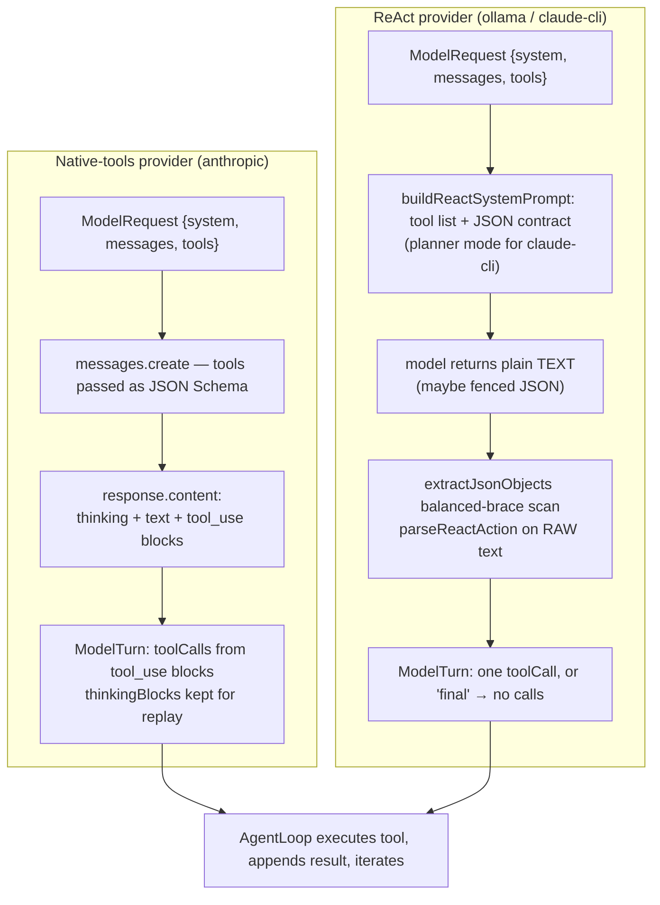

# LoopForge Providers

> The provider layer: how LoopForge turns any model — a scripted mock, a local Ollama model, the logged-in Claude Code CLI, or the Claude API — into the same one-turn `ModelProvider` interface that the loop drives.

**Why this exists.** The `AgentLoop` should not care whether a turn came from a frontier API, a 3-billion-parameter model on your laptop, or a hand-written script. It owns the conversation, the tools, and the trace; a provider's only job is to translate one request into one assistant turn. That single seam is what lets the same loop run a zero-cost, no-key demo in CI and a live Claude run in the dashboard without changing a line of loop code. This doc explains the abstraction, compares the four concrete providers, and walks through the ReAct adapter that lets tool-less models participate at all.

---

## The `ModelProvider` abstraction

One `complete()` call produces **exactly one assistant turn**. The provider never runs a tool, never appends to history, and never loops — the `AgentLoop` does all of that. A provider is a pure function from "the conversation so far + the available tools" to "what the model said next."

```ts
// packages/core/src/provider.ts
export interface ModelRequest {
  system: string;
  messages: ChatMessage[];
  tools: ToolDefinition[];
  /** Aborts an in-flight completion when the run is aborted. */
  signal?: AbortSignal;
}

export interface ModelTurn {
  thinking?: string;                                        // display-only
  thinkingBlocks?: { thinking: string; signature: string }[]; // for faithful replay
  text?: string;
  toolCalls: ToolCallRef[];
  usage: TokenUsage;
}

export interface ModelProvider {
  readonly name: string;
  readonly model: string;
  complete(request: ModelRequest): Promise<ModelTurn>;
}
```

### Who owns what

The loop is the only stateful party. Each iteration it calls `provider.complete(...)`, then folds the returned `ModelTurn` back into the provider-neutral `ChatMessage[]` history and executes any tool calls itself.

```mermaid
sequenceDiagram
  participant Loop as AgentLoop
  participant P as ModelProvider
  participant T as Tools (sandbox / game)

  Loop->>Loop: build ModelRequest {system, messages, tools, signal}
  Loop->>P: complete(request)
  P-->>Loop: ModelTurn {thinking?, thinkingBlocks?, text?, toolCalls, usage}
  Loop->>Loop: append assistant blocks to messages[]
  alt toolCalls.length === 0
    Loop->>Loop: finish("completed", finalText = turn.text)
  else has tool calls
    loop each toolCall
      Loop->>T: tool.execute(input, signal)
      T-->>Loop: ToolResult {output, isError}
    end
    Loop->>Loop: append tool_result blocks, next iteration
  end
```

Two consequences of this contract show up in every provider below:

- **A turn with zero tool calls ends the run.** The loop treats an empty `toolCalls` as "the model is done" and returns `turn.text` as the final answer (`packages/core/src/loop.ts`). ReAct providers exploit this: a `{"tool": "final", ...}` action is parsed into a turn with no tool calls.
- **`thinkingBlocks` are replayed verbatim.** The loop pushes each block (with its `signature`) back into the next request's assistant history. Only the Claude API needs this; every other provider returns `thinkingBlocks` undefined and the loop simply has nothing to replay.

The request is assembled in one place — `provider.complete({ system, messages, tools, signal })` in `loop.ts` — so `usage` is summed into the run total and every field of the turn is emitted as a `model_response` trace event regardless of which provider produced it.

---

## The four providers at a glance

| Provider | What it is | API key? | Cost | Native tool-calling? | Adapter |
|---|---|---|---|---|---|
| **`mock`** | Scripted `MockStep[]`; deterministic; tool calls execute for real | No | None | n/a (script emits calls directly) | none |
| **`ollama`** | Local model via Ollama HTTP (`llama3:latest` default) | No | None (local compute) | No — model advertises only `completion` | ReAct |
| **`claude-cli`** | The locally-installed Claude Code CLI (`claude -p`, `sonnet` default) driven as a single-turn model | No — uses the CLI's logged-in account | **Real per-iteration cost/quota** on that account | No — tools disabled on purpose | ReAct (planner mode) |
| **`anthropic`** | The Claude API via `@anthropic-ai/sdk` (`claude-opus-4-8` default) | **Yes** — `ANTHROPIC_API_KEY` | Paid API tokens | **Yes** — the only native-tools provider | none |

**How selection works.** The dashboard's `NewRunForm` / `NewEvalForm` posts a `provider` string; the REST layer validates it against the closed set `"mock" | "anthropic" | "ollama" | "claude-cli"` (`packages/server/src/index.ts`) and `RunManager.createRun` maps it to a concrete class, passing along the optional model override (below):

```ts
// packages/server/src/run-manager.ts
modelProvider =
  provider === "ollama"
    ? new OllamaProvider(options.model)
    : provider === "claude-cli"
      ? new ClaudeCliProvider(options.model)
      : new AnthropicProvider(options.model);
```

`mock` is handled on a separate branch that also prepares the environment and loads a script. For `anthropic`, both the run and eval routes reject the request up front with HTTP 400 if `ANTHROPIC_API_KEY` is not set on the server (`packages/server/src/index.ts`). The type alias lives at `packages/server/src/run-manager.ts`:

```ts
export type ProviderName = "mock" | "anthropic" | "ollama" | "claude-cli";
```

---

## The per-provider model override

Each real provider defaults to one model, but the model is **first-constructor-argument configurable** end to end, so the same provider can be run — and ranked on the leaderboard — under different models.

**The API field.** `POST /api/runs` and `POST /api/evals` both accept an optional `"model"` string, parsed by the shared `parseModel` helper (`packages/server/src/index.ts`):

```ts
// packages/server/src/index.ts — parseModel
if (raw === undefined) return { ok: true, model: undefined };
if (typeof raw !== "string") return { ok: false, error: "model must be a string" };
const trimmed = raw.trim();
if (trimmed.length > 120) {
  return { ok: false, error: "model must be at most 120 characters" };
}
return { ok: true, model: trimmed || undefined };
```

- Absent → the provider's constructor default applies.
- A non-string, or a string longer than **120 characters** → HTTP **400**.
- Whitespace is trimmed; an empty (or all-whitespace) string is treated as absent.
- **Ignored for `mock`** — the scripted provider has no model to swap, so `RunManager` only applies the override on the real-provider branch.

**Where it lands.** The parsed value travels as `CreateRunOptions.model` (`packages/server/src/run-manager.ts`) straight into the provider constructor. The defaults, from each constructor signature:

| Provider | Default model |
|---|---|
| `ollama` | `llama3:latest` |
| `claude-cli` | `sonnet` |
| `anthropic` | `claude-opus-4-8` |

**On evals.** The override is eval-wide: `EvalManager` records it on the summary as `model: string | null` (`null` = provider default) and forwards it to every run the eval creates, and the dashboard's leaderboard keys entries by **(provider, model)** so two models under the same provider rank as separate contenders (**[Eval Harness](EVAL_HARNESS.md)**).

**In the dashboard.** Both forms show a **Model** input for non-mock providers whose placeholder is that provider's default (`MODEL_PLACEHOLDERS` in `packages/web/src/components/NewRunForm.tsx`); switching provider resets the field, since model names are provider-specific.

---

## `mock` — scripted, deterministic, zero-key

`MockProvider` (`packages/core/src/providers/mock.ts`) is the backbone of the no-key demo and the eval harness. It holds an array of `MockStep`s and pops the next one on each `complete()`, with a small delay so the dashboard streams realistically.

```ts
// packages/core/src/providers/mock.ts
export interface MockStep {
  thinking?: string;
  text?: string;
  toolCalls?: { name: string; input: unknown }[];
  delayMs?: number;
}
```

The crucial property: **the tool calls a script emits are executed for real by the loop.** The mock does not fake tool output — it names a real tool (`write_file`, `move`, …) with real input, and LoopForge's tools run it against the actual sandbox or game. A well-written script therefore produces a genuinely working end-to-end run — files really change, the Sokoban board really moves — with no API key and perfect determinism.

- When the script runs out, it returns a graceful `"Mock script exhausted — ending run."` text turn (no tool calls → the loop ends).
- `usage` is approximated from message/step character counts (`≈ chars / 4`) so the dashboard's token meters have plausible numbers to show.
- Tool-call ids are deterministic (`toolu_mock_<cursor>_<index>`).

Scripts come from two places (`packages/server/src/run-manager.ts`): an eval can pin a specific script by key via `buildMockScript(...)` (e.g. the deliberately *lazy* coding run that must FAIL scoring), and a manual mock run falls back to the environment's own `buildDemoScript?.()`. This is why the mock provider is what powers both the offline demo and the deterministic eval baseline.

---

## `ollama` — local model, no key, ReAct

`OllamaProvider` (`packages/core/src/providers/ollama.ts`) talks to a local Ollama server (`http://localhost:11434/api/chat`) with `stream: false` and a low temperature (`0.2`, `num_ctx: 8192`) for steadier format adherence from small models.

The small local models here advertise only the `completion` capability — **no native tool calling** — so the provider leans entirely on the shared **ReAct adapter**. It builds an augmented system prompt with the tool list and JSON contract, maps the neutral history to Ollama's `{role, content}` messages, and parses the model's raw text back into a single tool call:

```ts
// packages/core/src/providers/ollama.ts
const messages: OllamaMessage[] = [
  { role: "system", content: buildReactSystemPrompt(request.system, request.tools) },
  ...request.messages.map(toOllamaMessage),
];
// ... fetch ...
return reactActionToTurn(content, {
  inputTokens: data.prompt_eval_count ?? 0,
  outputTokens: data.eval_count ?? 0,
});
```

Because Ollama takes a message array (not one flat prompt), the provider re-encodes history itself in `toOllamaMessage`: an **assistant** turn is rendered as the JSON action it took (`{"tool": ..., "input": ...}`) so the model sees its prior actions in exactly the format it must produce, and a **tool result** becomes a labeled `Observation:` (or `Observation (error):`) user message. Token counts come straight from Ollama's `prompt_eval_count` / `eval_count`. No API key, no cost beyond local compute.

---

## `claude-cli` — the Claude Code CLI as a raw model

This is the most interesting provider. `ClaudeCliProvider` (`packages/core/src/providers/claude-cli.ts`) drives the **locally-installed `claude` CLI** as if it were a plain single-turn model — no API key, using whatever account the CLI is logged into.

The CLI is normally a full agent with its own tools. The trick is to neutralize that and reduce it to a text-in / JSON-out model:

**1. Disable the CLI's real tools with a no-op allowlist.** Allowing only a single tool name that does not exist means the CLI has no tool it is permitted to run, so it can't act — it can only emit text.

```ts
// packages/core/src/providers/claude-cli.ts
/**
 * Allowing only a single tool name that does not exist disables every real
 * Claude Code tool ... (Disabling by name is fragile — the session also
 * carries Artifact/ToolSearch/Workflow/etc.)
 */
const NOOP_ALLOWLIST = "LoopForgeHarnessNoop";
```

**2. Replace the system prompt with the planner-framed ReAct format.** `buildReactSystemPrompt(..., { planner: true })` tells the model it is a planning module with *no* tools that only emits one JSON action for an external harness to run. That framing matters for a capable model: without it, Claude tends to try to invoke tools for real and then break format to explain that it can't. The transcript is flattened to a single prompt string because the CLI takes one prompt:

```ts
// packages/core/src/providers/claude-cli.ts
const system = buildReactSystemPrompt(request.system, request.tools, { planner: true });
const prompt = renderReactTranscript(request.messages);

const args = [
  "-p", "--model", this.model,
  "--system-prompt", system,
  "--exclude-dynamic-system-prompt-sections",
  "--allowedTools", NOOP_ALLOWLIST,
  "--output-format", "json",
];
```

**3. Run it, parse it through the same adapter.** The provider spawns `claude` with the prompt on stdin, parses the `--output-format json` envelope (`{ result, is_error, subtype, usage }`), and feeds `parsed.result` to `reactActionToTurn` — the exact same parser Ollama uses. So the model emits **our** JSON action, and **our** loop executes the tool. The `spawn` wrapper decodes stdout as UTF-8 (so multibyte characters split across chunks aren't corrupted), forwards `SIGTERM` on abort, and surfaces stdin `EPIPE` as a rejection.

**Cost reality.** Each turn is one stateless `claude -p` invocation, so the whole conversation is re-rendered as the prompt every iteration. That means **real per-iteration cost/quota** against the CLI's account — this provider showcases a real frontier model locally without an API key, but it is not for cheap high-volume runs.

---

## `anthropic` — the Claude API, native tools

`AnthropicProvider` (`packages/core/src/providers/anthropic.ts`) is the only provider with **native tool-calling**: it passes the tool definitions straight to `client.messages.create` and reads structured `tool_use` blocks back. It requires `ANTHROPIC_API_KEY` (auto-loaded from a gitignored `.env` via `packages/server/src/load-env.ts`), defaults to `claude-opus-4-8`, and requests up to `16000` output tokens.

**Adaptive thinking with summarized display.** The request enables `thinking: { type: "adaptive", display: "summarized" }`, so the dashboard can render the model's reasoning. Response blocks are split by type:

```ts
// packages/core/src/providers/anthropic.ts
for (const block of response.content) {
  if (block.type === "thinking") {
    // verbatim (text + signature) for replay; also accumulate text for display
    thinkingBlocks.push({ thinking: block.thinking, signature: block.signature });
    if (block.thinking) turn.thinking = (turn.thinking ?? "") + block.thinking;
  } else if (block.type === "text") {
    turn.text = (turn.text ?? "") + block.text;
  } else if (block.type === "tool_use") {
    turn.toolCalls.push({ id: block.id, name: block.name, input: block.input });
  }
}
```

**Thinking-block replay.** When thinking is on and a turn makes tool calls, the API requires the original thinking blocks (with signatures) to be sent back unchanged on the next request or it rejects the continuation. The provider preserves them on `turn.thinkingBlocks`; `toAnthropicMessage` maps neutral `thinking` blocks back to the wire format, and only replays a block if it has a `signature`.

**Refusal handling.** If `response.stop_reason === "refusal"`, the provider substitutes a safe message, clears `toolCalls`, and drops `thinkingBlocks` so the run ends cleanly rather than trying to replay a refused turn:

```ts
// packages/core/src/providers/anthropic.ts
if (response.stop_reason === "refusal") {
  turn.text = turn.text || "The model declined this request for safety reasons.";
  turn.toolCalls = [];
  turn.thinkingBlocks = undefined;
}
```

Usage comes directly from `response.usage.input_tokens` / `output_tokens`.

---

## The shared ReAct adapter (`react.ts`)

> One adapter, two providers: the bridge that lets a model **with no native tool-calling** still take one tool call per turn.

**Why it exists.** Native tool-calling returns structured `tool_use` blocks. A tool-less model returns only text. The ReAct adapter (`packages/core/src/providers/react.ts`) closes that gap by (a) teaching the model a strict JSON action format in the system prompt and (b) robustly parsing whatever text comes back into a `ModelTurn`. Both `ollama` and `claude-cli` depend on it; it has a dedicated test suite at `packages/core/src/providers/react.test.ts`.

### `buildReactSystemPrompt` — the contract in the prompt

It appends the tool list (rendered as `- name(arg1, arg2): description`) and the exact JSON shape to the environment's base system prompt:

```
On every turn, respond with a SINGLE JSON object and nothing else:
  {"tool": "<tool_name>", "input": { <arguments> }}
When the task is fully done, respond with:
  {"tool": "final", "input": {"answer": "<one-sentence summary>"}}
```

The `{ planner: true }` option (used by `claude-cli`) swaps the intro and adds a rule for capable models: it states plainly that the model *has no tools*, only emits JSON for an external harness, and must "Never try to call a tool directly and never break format to comment on the setup." This is what keeps a frontier model from trying to actually use tools and then apologizing out-of-format.

### The JSON action contract

- A tool step is `{"tool": "<name>", "input": { ... }}` → parsed into a single `toolCalls` entry.
- The sentinel `{"tool": "final", "input": {"answer": "..."}}` → parsed into a turn with **no** tool calls, which the loop treats as run completion; `answer` becomes the final text.

### Robust extraction — parse the RAW output

The parser never strips fences first. `extractJsonObjects` (an internal helper in `react.ts`) does a **balanced-brace scan** — walking the string char by char, tracking string state and escapes, and slicing each `{...}` where depth returns to zero:

```ts
// packages/core/src/providers/react.ts
if (inStr) {
  if (escaped) escaped = false;
  else if (ch === "\\") escaped = true;
  else if (ch === '"') inStr = false;
} else if (ch === '"') inStr = true;
else if (ch === "{") depth++;
else if (ch === "}") {
  depth--;
  if (depth === 0) { objects.push(text.slice(i, j + 1)); break; }
}
```

This finds the action even when the model wraps it in a ```` ```json ```` fence, and — critically — parsing the **raw** object means a string value that legitimately contains backtick fences survives intact. That is exactly the case where a `write_file` action's `content` is a Markdown file with its own code block: stripping fences up front would corrupt the payload, so the parser scans the raw text and lets `JSON.parse` handle the escaping. `parseReactAction` tries each extracted candidate in order and returns the first that parses to an object with a string `tool`; text before that object is captured as the `thought`.

### `reactActionToTurn` — text → `ModelTurn`

The final glue both ReAct providers call:

```ts
// packages/core/src/providers/react.ts
const action = parseReactAction(content);
if (action && action.tool !== "final") {
  return {
    text: action.thought,
    toolCalls: [{ id: `toolu_react_${...}`, name: action.tool, input: action.input }],
    usage,
  };
}
// "final", or no parseable action → a text-only turn that ends the run
```

- A real action → a one-tool-call turn (its `thought` preambles land in `text` for the trace).
- A `final` action → text-only turn (`answer`, falling back to `thought`) with no tool calls.
- No parseable JSON at all → the whole (fence-stripped) content becomes the final text, so a model that just answers in prose still terminates cleanly instead of hanging.

`renderReactTranscript` is the counterpart for one-prompt backends (the CLI): it flattens the neutral history into `Assistant:` / `Observation:` blocks and ends with `"Your next action (JSON only):"`.

---

## Native tools vs. ReAct: one turn, contrasted

The loop is identical in both cases — the same `ModelRequest` goes in, the same `ModelTurn` comes out, the same tool executes. The difference is entirely inside `complete()`.



The native provider gets structure from the wire protocol; the ReAct provider manufactures the same structure from text. Both hand the loop a `ModelTurn` it cannot distinguish.

---

## How to add a new provider

Everything is keyed off the `ModelProvider` interface, so a new backend is a small, contained addition.

1. **Implement the interface.** Create `packages/core/src/providers/<name>.ts` exporting a class with `readonly name`, `readonly model`, and `async complete(request): Promise<ModelTurn>`. Map `request.messages` (the neutral `ChatMessage`/`ContentBlock` shape) to your backend's wire format, honor `request.signal` for abort, and always return `usage`.

2. **Decide native vs. ReAct.**
   - *Native tool-calling* (like `anthropic`): pass `request.tools` to the backend and translate its structured tool calls into `toolCalls: ToolCallRef[]`.
   - *No native tools* (like `ollama` / `claude-cli`): reuse the adapter — `buildReactSystemPrompt(request.system, request.tools, { planner? })` for the system prompt, then `reactActionToTurn(rawText, usage)` on the response. Use `renderReactTranscript` if your backend takes one flat prompt instead of a message array. Do not reinvent the JSON parsing.

3. **Return the turn faithfully.** Set `text`/`thinking` for the trace; only populate `thinkingBlocks` if your backend requires verbatim replay (currently just the Claude API). Remember the loop's contract: **empty `toolCalls` ends the run** — return no tool calls when the model is done.

4. **Export it.** Add the class to the core barrel (`packages/core/src/index.ts`), next to the existing `export { ... } from "./providers/..."` lines.

5. **Wire selection into the server.** Add the string to `ProviderName` (`packages/server/src/run-manager.ts`), instantiate it in the `createRun` selection branch, extend the REST validation set in `packages/server/src/index.ts`, and add an API-key/precondition guard there if the backend needs one (mirror the `ANTHROPIC_API_KEY` check).

6. **Surface it in the dashboard.** Add the option to `NewRunForm` / `NewEvalForm` (`packages/web/src/components/`) so it appears in the run and eval forms.

7. **Test it.** For ReAct backends, the adapter is already covered by `packages/core/src/providers/react.test.ts`; add cases for any provider-specific mapping (history encoding, usage extraction, error/refusal handling). Run `npm test -w @loopforge/core` and `npm test -w @loopforge/server`.

Because the loop, the scorer, and the dashboard all consume `TraceEvent`s and never touch a provider directly, a correctly implemented `complete()` is enough to make the new model work everywhere — live runs, the eval harness, and the timeline UI — with no further changes.

---

## Related documentation

- **[Architecture](ARCHITECTURE.md)** — how the `ModelProvider` seam fits into the loop lifecycle and the `TraceEvent` pipeline.
- **[Environments](ENVIRONMENTS.md)** — the tools and system prompts a provider drives, per environment.
- **[Eval Harness](EVAL_HARNESS.md)** — running a whole suite under any provider, and reading the leaderboard.
- **[Development](DEVELOPMENT.md)** — local prerequisites for each provider (Ollama, the Claude CLI, `ANTHROPIC_API_KEY`).
- **[Documentation index](README.md)** — all docs in reading order.
